[Return to ReadMe file](README.md)

## Table of Contents

### 1. [Version Control](#version-control)

### 2. [Heroku](#heroku)

### 3. [Amazon Web Services](#aws)


### Version Control

- This project was built using [GitPod](https://gitpod.io/workspaces/) as the code editor.

- The repository is hosted on [Github](https://github.com/) with all code being stored here.

- For the build of this project Git has been used for all version control. This project has also made use of working with remote branches which were assigned using a naming convention primarily of `feature/branch-work`, `fix/branch-fix`, `functionality/branch-function` and `page/branch-page` then creating branch pull requests before merging. Work was completed in this manor to better organise workflow as well as making the possibility to undo/roll back to certain points in the git history much easier and more effective. 

- See below the output from the extension [Git Graph](https://marketplace.visualstudio.com/items?itemName=mhutchie.git-graph) which displays the git history and more specifically the action of PR's and merge requests.

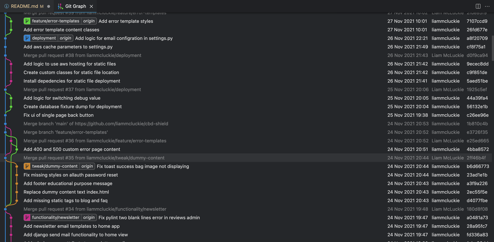

---

### Heroku 

This project is live and automatically deployed to [Heroku](https://www.heroku.com). The following steps outline the necessary steps to set-up and deploy a project that uses Python and Django.

1. Firstly ensure that your project dependencies and requirements are set up and included in a `requirements.txt` file in the root of your project folder. This can be done by installing all packages found in said file.
    - This also includes setting environment variables locally such as below. If needed you can generate a secret key from [Django secret key generator](https://miniwebtool.com/django-secret-key-generator/), however the Stripe keys will need to be obtained from your Stripe account in the developer dashboard.

    ```
    SECRET KEY:
    STRIPE_SECRET_KEY:
    STRIPE_PUBLIC_KEY:
    ```

2. Once this has been done a Procfile must be created as this is what Heroku uses to successfully execute and run the app. For this app to successfully deploy and run Heroku needs to be told the server that is being used, in this case [Gunicorn](https://gunicorn.org/). Add the following to your Procfile document - `web: gunicorn app_name.wsgi:application`.

3. Once the above files have been correctly created commit and push these to your GitHub repository.

    Create an account/log in to your Heroku account and select "New App", then choose the app name and select a region closest you your own.

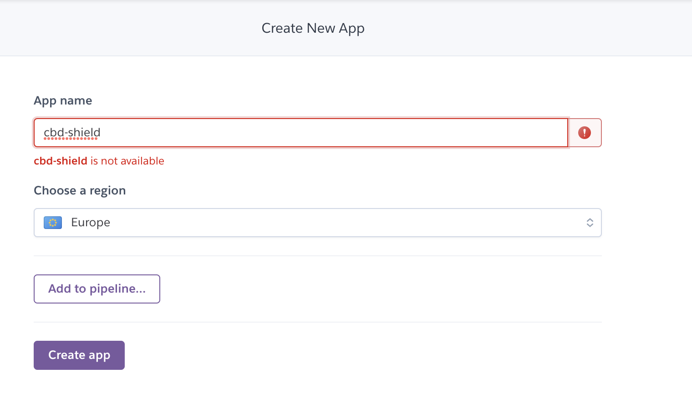

4. Then choose the provisions tab in order to set up a Postgres database for the app. Search Heroku Postgres and choose the 'Hobby Dev - Free' option.

5. If you have not already installed the following packages then please do so by running the below commands.
    - `pip3 install dj_database_url`
    - `pip3 install psycopg2-binary`
    - `pip3 install gunicorn`

    - Open the apps settings.py file and import dj_database_url.
    - Remove the default Django database configuration and add the below code to configure the new database. The code uses logic to determine whether to use to the local database or the Heroku version.

    - For this to work you will need to add the 'DATABASE_URL' env variable to your Heroku app. To do this navigate to the settings tab, select reveal config vars and copy the relevant variable and add this to your local environment however you choose to store these. See below for access to heroku config vars.

    ```
    if 'DATABASE_URL' in os.environ:
        DATABASES = {
            'default': dj_database_url.parse(os.environ.get('DATABASE_URL'))
        }
    else:
        DATABASES = {
            'default': {
                'ENGINE': 'django.db.backends.sqlite3',
                'NAME': os.path.join(BASE_DIR, 'db.sqlite3'),
            }
        }

    ```

    - * Note - If you are using Gitpod as your IDE and development environment when adding the Database variable you will need to restart your workspace for this to take effect.

    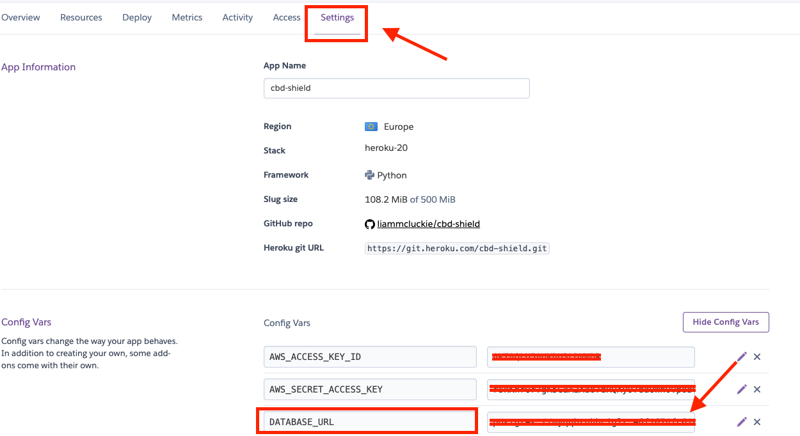

6. You will now need to migrate the local database to the Heroku app by running firstly starting with the models.
    - Run `python3 manage.py migrate`
    - Then to re-create the database run - `python3 manage.py dumpdata --exclude auth.permission --exclude contenttypes > db.json` this creates a backup of the database and dumps all necessary data into a json file.
    - To export this data to Heroku run - `python3 manage.py loaddata db.json`

7. In order to access the admin dashboard and product management of this site you will need to create a superuser for the deployed version. This is done with the following command.
    - `python3 manage.py createsuperuser` then fill out the required fields.
    - Once deployed you will need to login into Django admin and confirm the superuser.

8. Before the initial deployment to Heroku can be completed it is necessary to tell Heroku to not collect static files. To do this navigate back to the Heroku Config Vars and add the below screenshot.

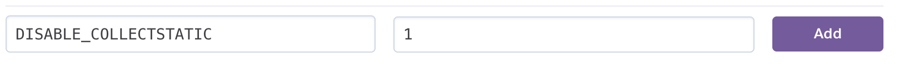

9. The deployed host needs to be added to the application allowed hosts in settings.py, see the example taken from this project.

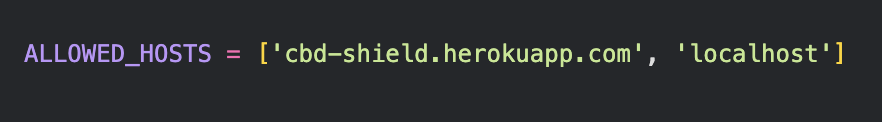

10. Once all the above is completed commit and push your changes to your repository.

11. Then you will need to push the main branch to Heroku using the following commands.
    - To intialise remote repository access - `heroku git:remote -a heroku-app-name`
    - To push main branch for deployment - `git push heroku master`

12. If necessary the app can be set to automatically push to Heroku whenever changes are pushed on the main branch. Navigate to the deploy tab in Heroku, then on deployment method select 'Connect to GitHub', and search for the repository and click connect.

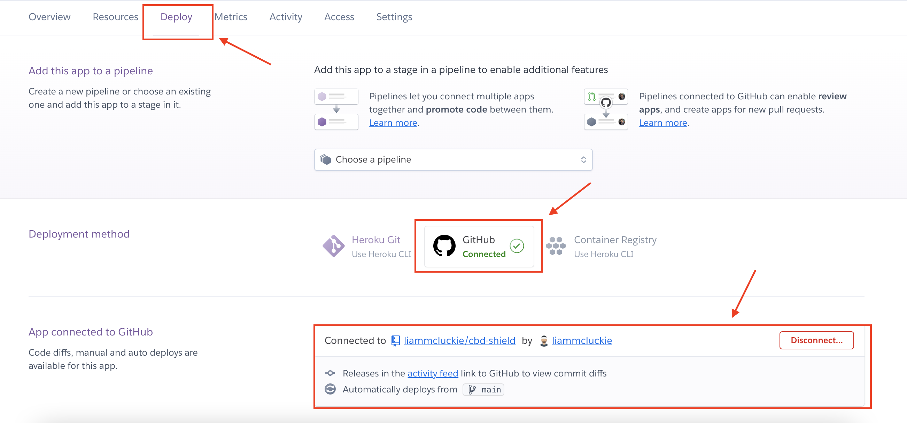

13. Once connected scroll further down the same page and on the 'Automatic Deploys' section and choose the 'Enable Automatic Deploys' button to finish setting this up. 

---

### AWS

This project uses Amazon Web Services to host all static files and media files. The following steps will allow you to set up and configure this with the already deployed Heroku App, completing the deployment process.

1. First navigate to [aws](https://aws.amazon.com/) and create an account, then choose 'Personal Account' and add user credentials and create the account. You will be required to add payment details, this application is not designed to go over the free usage threshold, but if you plan to scale then you could be charged.

2. Sign in to your created account in the AWS Management Console under the My Account dropdown and search for S3 in services and select 'Bucket'.

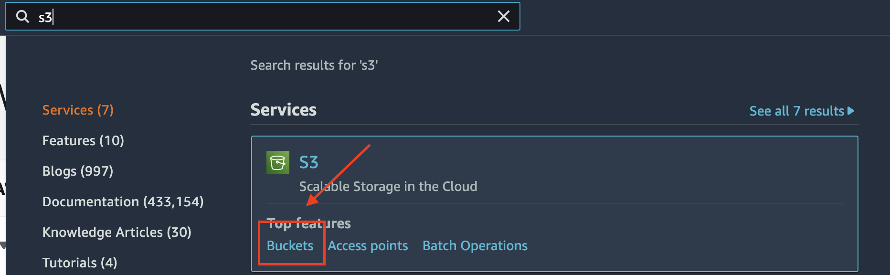

3. Then select the orange 'Create Bucket' button and name the bucket matching the app name and choose a region closest to your own. De-select the 'Block all public access' checkbox and acknowledge that the bucket will be public and create bucket.

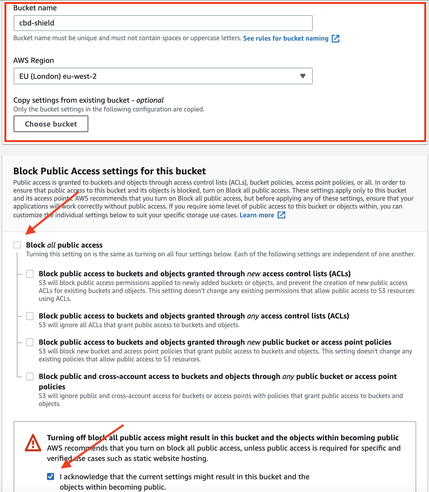

4. Once created select the app bucket, choose the properties tab and scroll down to the 'Static website hosting' section and select edit and add the following settings. Note in this app the Index document and Error document function using Django and not AWS.

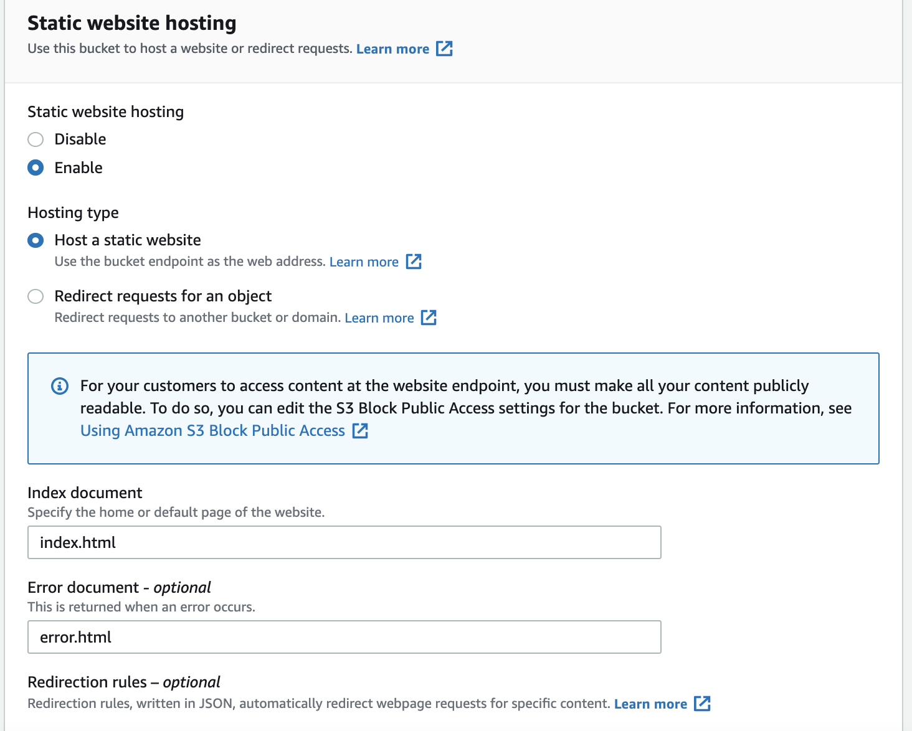

5. Choose the permissions tab and scroll down to the CORS section, select edit and add in the below code.

    ```
    [
        {
            "AllowedHeaders": [
                "Authorization"
            ],
            "AllowedMethods": [
                "GET"
            ],
            "AllowedOrigins": [
                "*"
            ],
            "ExposeHeaders": []
        }
    ]
    ```

6. Then whilst in the permissions tab navigate to the bucket policy section and edit. Then choose the Policy Generator button and configure to look like the below image. The second image shows where to find the ARN (Amazon Resource Name).

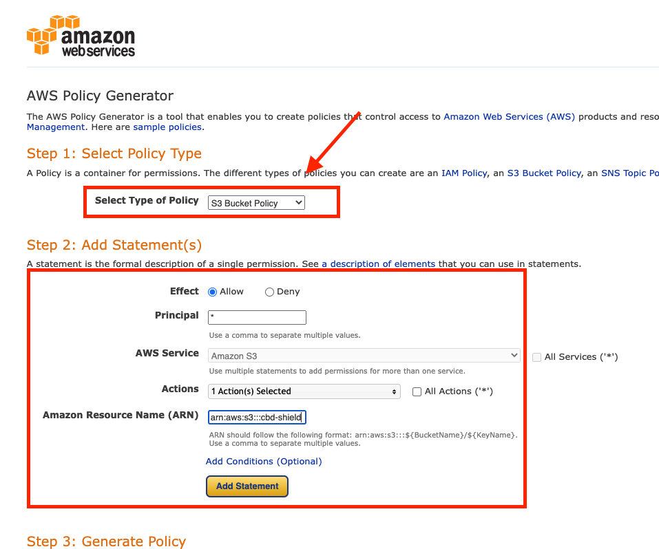

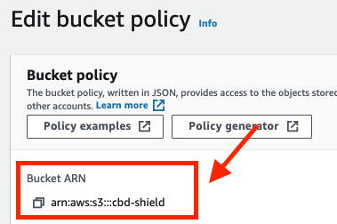

Then select add statement then the generate policy button displayed below. This will display a json document policy that needs to be copied and added into to bucket policy editor then saved. Note that this project requires all access to the Resource so a `/*` is added to the end of the resource value as pictured below.

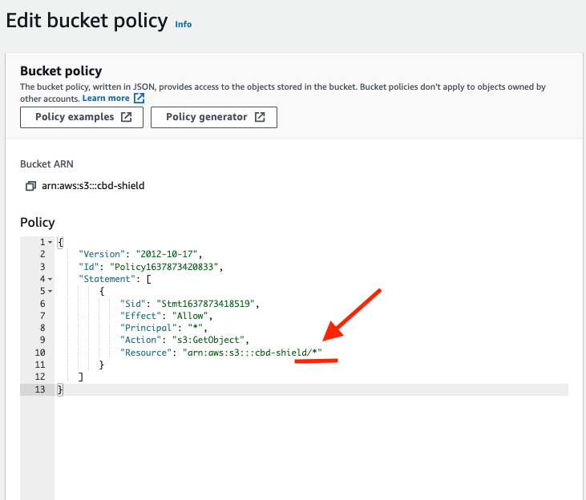

7. Next, on the permissions tab scroll down to the Access Control List section and choose edit. Then on the public access row under the Objects column check the list box.

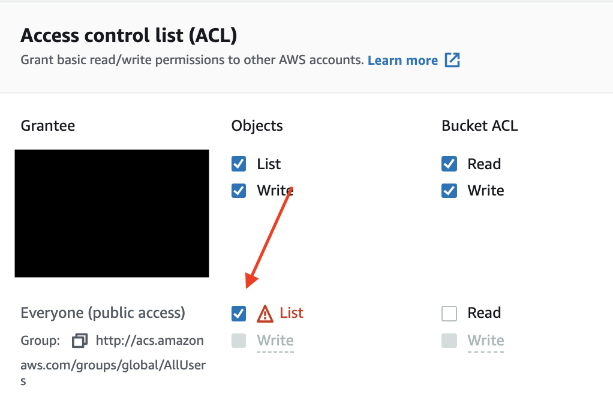

8. Now in the services tab search for IAM and select groups.

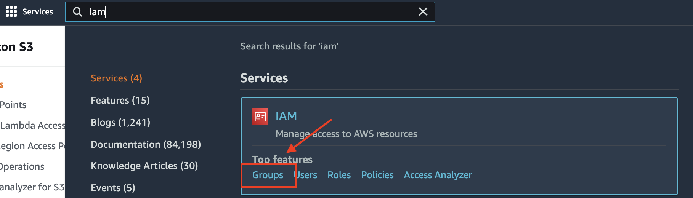

Then select the create new group button and call the group 'manage-project-name' then select create group.

9. Next in the sidebar select the Policies link and click create policy and choose the JSON tab. Then choose the import managed policy link and search for S3 and import the below policy.

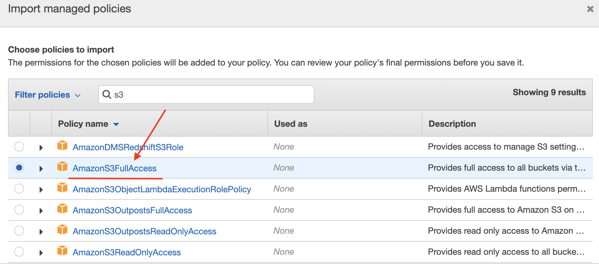

This policy will need changing slightly due to the access requirements for this project. Copy the ARN number and add this to the Resource value as shown below.

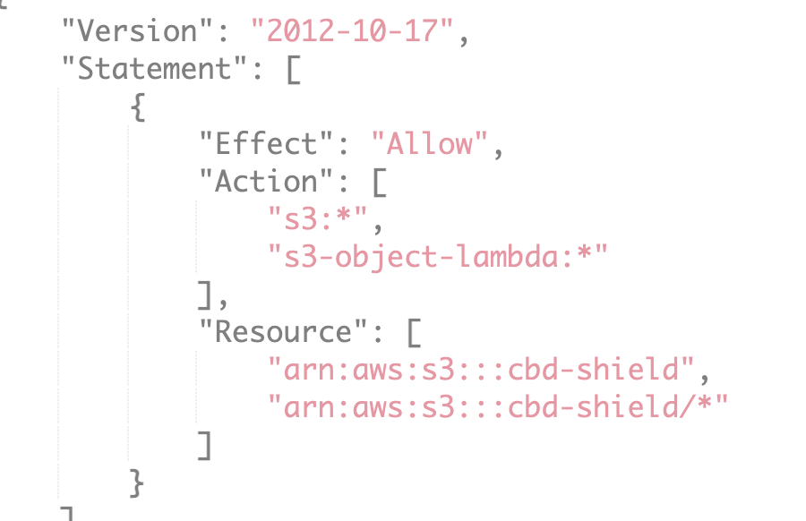

Then select review policy, give the policy a name, description and create policy. Now attach the policy to the created group by choosing User Groups in the sidebar, choose the app group, select Attach Policy, search for the created policy and attach.

10. Next create a user to add to the group by selecting the users link in the sidebar, then click the Add User button. For naming convention best practice to name the user is 'app-name-staticfiles-user' then check the Programmatic access box and choose next

Then choose the correct group that will be displayed below and click through to create user. This will then display a success message with an option to download .csv, this contains important necessary credentials.

11. If you have not already in order to connect the app to the now created S3 bucket you will need to install the following packages.
    - `pip3 install boto3`
    - `pip3 install django-storages`

Then check that 'storages' is included in the installed apps in the projects settings.py file.

12. In Heroku add the AWS variables and a variable called 'USE_AWS' to the config vars, these can be found in the downloaded .csv file and should be named as below. Now you can also remove the `DISABLE_COLLECTSTATIC' variable as it is no longer needed.

    ```
    AWS_ACCESS_KEY_ID:
    AWS_SECRET_ACCESS_KEY:
    USE_AWS: True
    ```

13. In the apps settings.py file add the following logic to tell the app to use the created AWS bucket for static files.

    ```
    if 'USE_AWS' in os.environ:
        # Bucket config
        AWS_STORAGE_BUCKET_NAME = 'cbd-shield'
        AWS_S3_REGION_NAME = 'eu-west-2'
        AWS_ACCESS_KEY_ID = os.environ.get('AWS_ACCESSS_KEY_ID')
        AWS_ACCESS_KEY_ID = os.environ.get('AWS_SECRET_ACCESSS_KEY')
        AWS_S3_CUSTOM_DOMAIN = f'{AWS_STORAGE_BUCKET_NAME}.s3.amazonaws.com'

        # Static and media files
        STATICFILES_STORAGE = 'custom_storages.StaticStorage'
        STATICFILES_LOCATION = 'static'
        DEFAULT_FILE_STORAGE = 'custom_storages.MediaStorage'
        MEDIAFILES_LOCATION = 'media'

        # Override statuc abnd media URLs in products
        STATIC_URL = f'https://{AWS_S3_CUSTOM_DOMAIN}/{STATICFILES_LOCATION}/'
        MEDIA_URL = f'https://{AWS_S3_CUSTOM_DOMAIN}/{MEDIAFILES_LOCATION}/'
    ```

14. Next create a file in the apps root directory called `custom_storages.py` and add the following code to tell Django to use AWS in production.

    ```
    from django.conf import settings
    from storages.backends.s3boto3 import S3Boto3Storage


    class StaticStorage(S3Boto3Storage):
        location = settings.STATICFILES_LOCATION


    class MediaStorage(S3Boto3Storage):
        location = settings.MEDIAFILES_LOCATION
    ```

15. Once all of the above is complete push changes which will automatically deploy to Heroku and you will now see a static folder in the S3 bucket from the project.

16. Back in the S3 bucket for this app choose to add new folder in the same directory as the static folder called media. Then inside this folder upload all necessary images for the app, click next and choose the option to 'Grant public read access to this object' and upload.

17. Finally since this project uses Stripe Webhooks the deployed endpoint needs to be added. Navigate to the Stripe developers tab then webhooks and choose add endpoint and configure as shown below.

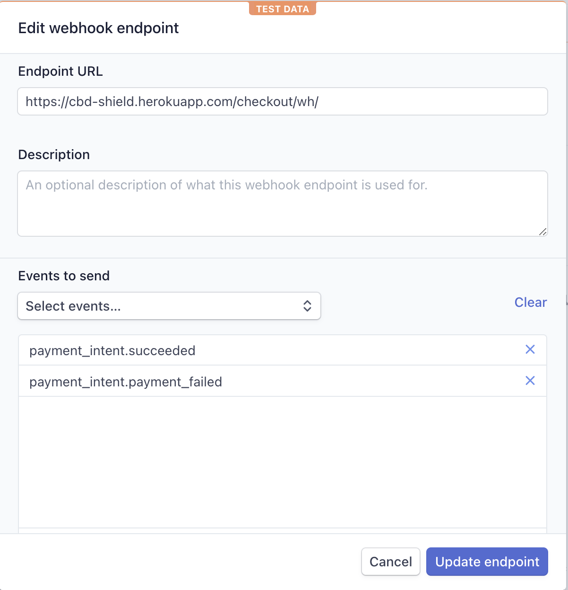

You can now select to reveal the webhook signing secret and add this to the Heroku config vars named `STRIPE_WH_SECRET`.