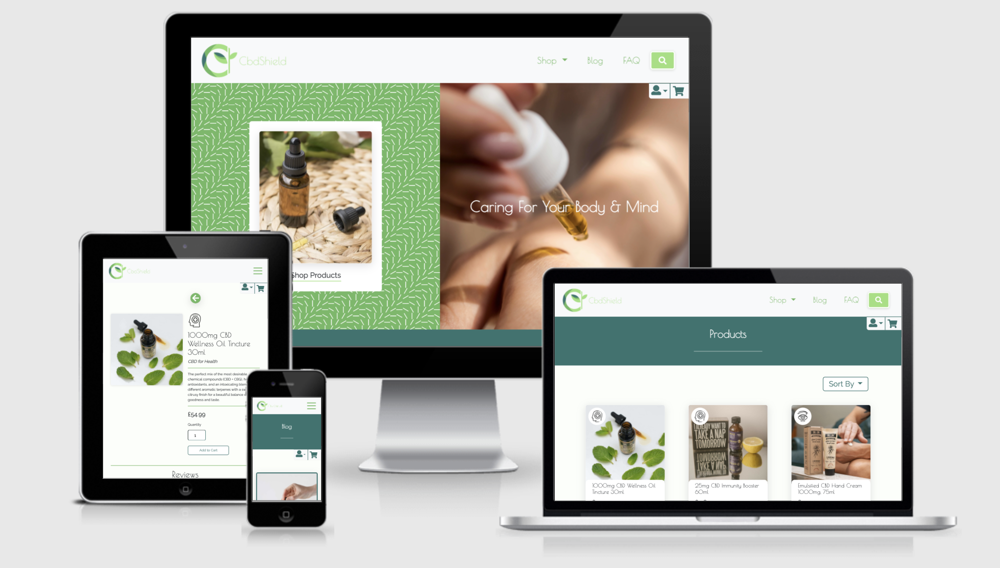
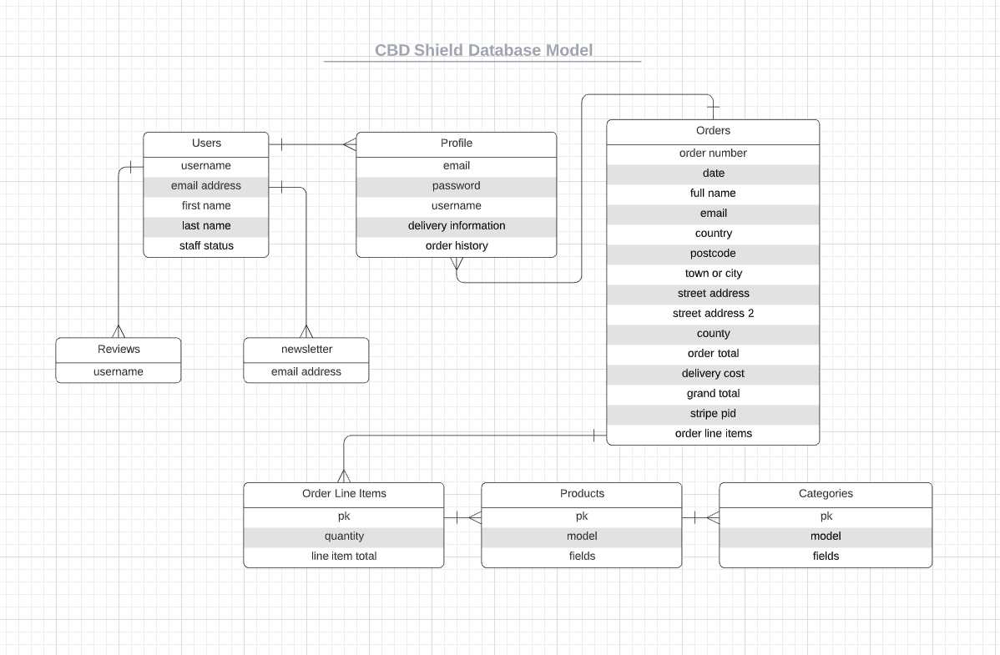

# CBD Shield

[View Live Project Here](#)

## Overview

CBD shield are a modern health brand producing healing products using natural ingredients with the environment being at the core of the brand values. The audience focus is aimed at users who value their health and the environment, CBD Shield aim to educate users through content and imagery as well as sell their products. This is a complete and functioning e-commerce website that allows users to purchase products and register an account both with full CRUD management. This project will have a strong focus on using templating frameworks, database management, security and dynamic content.

## Table of Contents

## Table of Contents

### 1. [UX](#ux) 
    
#### 1a. [User Stories](#user-stories)

#### 1b. [User Centered Design](#user-centered-design)
- Strategy 
- Scope 
- Structure 
- Wireframes

### 2. [Design](#design)
- Colour Scheme
- Typography
- Imagery

### 3. [Database Model](#database-model)

### 4. [Features](#features)

### 5. [Technologies Used](#technologies-used)
- Syntax
- Frameworks, Libraries & Programs

### 6. [Testing](#testing)
- [Testing Document](TESTING.md)

### 7. [Deployment](#deployment)

#### 7a. Version Control

#### 7b. Heroku 

#### 7c. GitHub
- Forking the Repository 
- Cloning the Repository

### 8. [Credits](#credits)
- Resources
- Code 
- Media

## UX

### User Stories

- **User Goals**

    a. As a user, I want to be able to access the site from any device.

    b. As a user, I want to know that my personal information is safe and stored securely on a database.

    c. As a user, I want to enjoy using the website through great aesthetics and a strong UX/UI.

    d. As a user, I want to be able to find using the websites functionality simple with clear instructions.

    e. As a user, I want to have full control of my account following computer programming CRUD (create, read, update & delete) operations.

    f. As a user, I want to know that I am able to complete payments securely and my details are safe.

- **First Time Visitor Goals**

    a. As a first time visitor, I want to immediately and clearly understand the purpose of the website and the business.

    b. As a first time visitor, I want to find the UI eye catching, clear and professional looking. Increasing my trust in this website.

    c. As a first time visitor, I want to be able to easily navigate around the site at various stages of a page through the use of call to actions.

    d. As a first time visitor, I want to find out more information about the products and how they work.

- **Returning Visitor Goals**

    a. As a returning visitor, I want to find reviews and testimonials of the brand and products.

    b. As a returning visitor, I want to find out detailed information about specific products.

    c. As a returning visitor, I want to be about to contact the site owner if I have any issues or questions.

    d. As a returning visitor, I want to be able to sign up to a newsletter for offers and information.

- **Frequent Visitor Goals**

    a. As a frequent visitor, I want to find purchasing products a smooth and simple process.

    b. As a frequent visitor, I want to be able to create a profile and save my details for future purchases.

    c. As a frequent visitor, I want to see all my previous and current order history.

    d. As a frequent visitor, I want to see new products and offers listed on the home page.

    e. As a frequent visitor, I want to receive email confirmations with order details upon purchasing products.

---

### User Centered Design

#### Strategy

- The main goal of this website is to convert visitors into customers and frequent users with accounts. Due to products produced by CBD Shield there will be a lot of detailed information on how the products benefit users, why using CBD is so beneficial, who should use these types of products and the different types of CBD products and their benefits. This content will be displayed using high quality, professional imagery, icons and copy. 

- To achieve the sites goals the most important information will be displayed on the landing page whilst being careful to not overload the user. The features and UI will play a huge role in displaying this information to the user in the best way possible making use of icons to portray categories, imagery of products in use and eye catching call to actions that direct users to more in depth information.

- One of the most important pages on the site that will be used to convoy necessary information to users will be through the sites FAQ page that will include detailed questions that cover all aspects of CBD. This page will include interactive functionality whilst keeping with the sites clean and modern UI.

- The ideal steps that a new user would take are the following;

    - Explore the websites landing page, reading the informative information about the business and products.

    - Look through the landing pages imagery and call to actions.

    - Follow the call to actions either to products or more in depth information.

    - Navigate to the FAQ page to further enhance knowledge of the product.
    
    - Move onto the events page to further enhance their knowledge of this type of business and it's products.

    - Sign up to the newsletter to receive offers and more information about these products.

    - Through informative content discover the best product for their needs.

    - Purchase said products and create an account to save order details.

    - Remain a regular user to the site due to an enjoyable website experience and a connection made with the brand through this.

---

#### Scope | Trade Off

- **The main features and content in the initial design plan that are of the highest priority are;**

    - Fully responsive website regardless of viewing device size.

    - Detailed information/about sections.

    - Detail product descriptions.

    - A blog page that contains all the latest news.

    - Eye catching CTA's using imagery and copy. 

    - Allow users to create accounts and have full CRUD functionality over this.

    - A secure payment system.

    - Validated and error free forms or various types.

    - Search functionality of products on the website.

    - The ability for users to leave reviews for products and allow these users to have CRUD functionality over their own reviews.

    - This website will include pages such as;
        - Homepage
        - Blog Page
        - Products page - organised into product types/categories
        - FAQ Page
        - Profile page
        - Register/login page
        - Relevant purchasing pages - cart, checkout etc

- **The features and content in the initial design plan that are of a lower priority and may not be including in this build are;**

    - Related/recommended products to be displayed whilst viewing certain products.

    - Testimonials of the brand and products.

    - New/special product carousels.

    - A gallery section containing products and these products in use.

    - Multiple product images on product pages.
    
    - The ability for users to add further information to their profile page such as preferences, images, bio descriptions etc.

    - A functioning and correct Instagram feed display showing the brands most up to date posts.

---

#### Structure

- The basic structure of the website is;

- Header/Navigation - *Top Level*

    - This website will use a standard navigation bar, there is no need for this to be a fixed navbar as there will be a back to top button implemented throughout the site for UX purposes.

    - The main navbar will collapse on medium screen sizes into a hamburger menu, but the functionality will remain the same.

    - The navigation menu will feature a search bar allowing the user to immediately search the sites products.

    - The header section will include and eye catching hero image alongside information, snappy hero text that acts as a call to action. This feature will include well thought out white space and on brand colours.

- Body - *Main Page Elements*

    - There will be a combination of copy and images used as CTA's and information conveying sections.

    - The landing page will feature a grid layout that makes use of cards with product categories that act as links to the category selected. Relevant icons will also be used on these cards as a way to further enhance the users understanding of the products.

    - The Products page overview will be in a typical e-commerce grid layout that includes some minimal product information such as name and price.

    - Individual product pages will include a main product image and a short description with price at the top level. Then further down there will be a detailed description, further images and product reviews.

    - The pages specific to using forms will have minimal to none additional content in order for the forms to be the main focus point.

    - The layout of the FAQ page will be in a accordion style with the FAQ title being displayed alongside an icon, then once selected the FAQ copy will be displayed.

    - The blog page will make use of alternative card layouts with aesthetically pleasing animation effects.

    - Newsletter sign up form will be displayed in a cta style format that is bold and eye catching.

- Footer - *Bottom Level*

    - A repeated navigation menu to reduce the need for the user to scroll up to continue navigating.

    - Social media links placed here to ensure the user does not navigate away from the page to soon.

    - Copyright and legal information placed here.
    
    - The websites logo to reinforce the users awareness of the company.

---

#### Wireframes

- [Desktop website view](wireframes/cbd-shield-desktop.pdf)

- [Tablet website view](wireframes/cbd-shield-tablet.pdf)

- [Mobile website view](wireframes/cbd-shield-mobile.pdf)

## Design

### Colour Scheme

- The colour scheme for this website contains three colours a main, secondary and accent colour, there will also be darker tones of these colours to improve accessibility. There will also be typical success and error colours used such as variations of green and red. The three main colours used within this site are all colours taken from the brands logo, this keeps the website on-brand and professional looking. There will also be a heavy emphasis on using white space, this is to give a clinical feel to the website in a positive way. The idea behind this is to increase users trust in the products by portraying that they are created by medical professionals, which they are.

- Feigoa (#9AE17A) - Primary Colour - A mid tone pale green that features as the main colour in the logo. This green relates well with the type of products being sold and adds a fun, enjoyable tone to the colour palette.

- Fern (#6BBA62) - Primary Alternate Colour - A slightly darker shade of Feigoa, this colour will be used to increase readability of copy to ensure accessability is high. As well as this it will also add slight but effective contrast when used alongside the primary colour.

- Oracle (#327270) - Secondary Colour - A blue, grey and green toned colour that works exceptionally well alongside the primary colour. This colour will be used to break up sections and add contrast to important features making them stand out to the user.

---

### Typography

- There will be two fonts used throughout the website. The font Poiret One will be used as the site title font and logo font, however if fitting, it may also be used for certain body elements such as buttons. The body font used will be Raleway which has many similar aspects to the title font since they are both Sans-serif with art-deco styles making them work extremely well together.

- **Poiret One** - A fresh decorative geometric grotesque with a hint of Art Deco and c‘onstructivism. Poiret One is a unique typeface with light forms and pure elegance based on geometric forms.

- **Raleway** - Raleway is an elegant sans-serif typeface, designed in a single thin weight. It is a display face that features both old style and lining numerals, as well as a stylistic alternate inspired by more geometric sans-serif typefaces.

---

### Logo

- The logo for this project was generated through [Hatchful](https://hatchful.shopify.com/) for the initial design, I then customised the font and colours. The colours were chosen to further enhance a customers understanding of the brands values focusing on using natural ingredients in a sustainable way which is why the green variants are so important. This is also the reason behind the seedling sprouting used in the logo which further evokes these emotions. This then led to the choice of an art-deco style font which adds a clean, modern and stylish feel to the logo as well as giving the brand a sought after luxury feel.

---

### Imagery

- Imagery will be featured throughout this website in such features as hero's, cta's, products, faq/about, and general content sections. There will be a mix of imagery subjects such as athletes and sportspeople, general lifestyle, and environmental subject matters. Other than specific product images all other images will feature a person as a subject, whether this be using the products, lifestyle images of desireable subjects, or athletes taking part in their sport. The reason for using these types of images is to make the use of the products relatable to the consumer, as well as displaying the varied healing/recovery uses of the products.

- Icons will be featured throughout this site with minimalist use. The main section featuring icons will be a category card display that uses icons to portray the different uses of those products. Icons may also feature to add small details of illustration to sections as well as in some hover effects.

## Database Model

- This project uses two types of databases, one for local development and one for the deployed production version. Locally it uses Django's built in [MySQL](https://www.mysql.com/) database. For the deployed version the database used is [PostgreSQL](https://www.postgresql.org/) with psycopg for performance reasons.

- [MySQL](https://www.mysql.com/) - is an open-source relational database management system. A relational database organizes data into one or more data tables in which data types may be related to each other; these relations help structure the data. SQL is a language programmers use to create, modify and extract data from the relational database, as well as control user access to the database.

- [PostgreSQL](https://www.postgresql.org/) - PostgreSQL is a powerful, open source object-relational database system with over 30 years of active development that has earned it a strong reputation for reliability, feature robustness, and performance.

---

### Database Schema

- The database schema for this project can be split into two main models, users and products. Both of these models are relational to each other and also have further relation models listed below.

- Users - Other relational models to the users table are;
    - Profile - This can only be created if the user has registered and confirmed their email address. The details to populate the profile are taken from the user model such as email and name.
    - Reviews - Reviews can only be added by authenticated users, when a user adds a new review the review is saved to the database with the users email address attached.
    - Newsletter - The newsletter sign up form is available to all users of the site. Once the form is validated the users email address is stored in the Newsletter model.

- Products - Other relational models to the products table are;
    - Orders - These are created when the user completes an order, it contains product details as well user details, which if selected will be added to the profile model.
    - Categories - The category pk number is shared with the product model in order to effectively assign categories to the products.
    - Order Line Items - This is created when the user completes an order and only holds the product details which are then shared with the profile model.

See image below for the database model created for this project.

