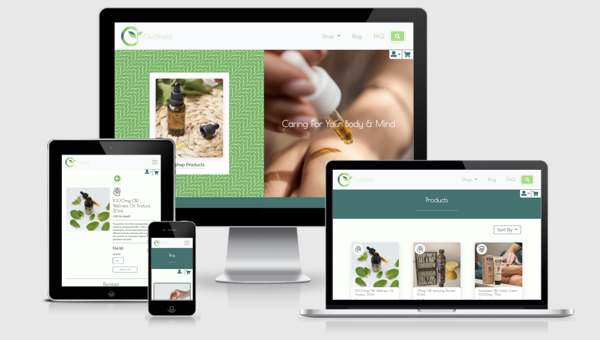

[Return to ReadMe file](README.md)

## Testing Table of Contents

### 1. [Code Validation](#code-validation)

### 2. [User Story Testing](#user-story-testing)

- [First Time Visitor Goals Testing](#first-time-visitor-goals-testing)
    
- [Returning Visitor Goals Testing](#returning-visitor-goals-testing)

- [Frequent Visitor Goals Testing](#frequent-visitor-goals-testing)

### 3. [Browser Compatibility and Device Responsiveness Testing](#browser-compatibility-and-device-responsiveness-testing)

### 4. [Google Lighthouse Testing](#google-lighthouse-testing)

### 5. [Bugs](#bugs)

## Code Validation

Throughout this project all code has been regularly ran through HTML, CSS, Javascript and Python validators to ensure there are no errors within the code. See below screenshots of all validated and passed code. Due to the nature of this project and the use of Django templating code the HTML was passed into the validator from viewing page source in the browser.

Outlined for each page is the decision why the warnings present have not been corrected.

### [CSS Validation](readme-screenshots/testing/css-valid.png)

- The warnings present for this projects CSS were related to the use of CSS variables and added prefixes. Therefore warnings were ignored as these practices are deemed valid.

---

### [HTML Validation](readme-screenshots/testing/html-valid.png)

- All HTML for this project is free from errors after fixing through testing. The errors present before fixing were as follows.
    - Having input elements as direct descendants of a button element the fix for this is shown below and the commit to see the code difference is [here.](https://github.com/liammcluckie/cbd-shield/commit/b2cf33935f66ce71b4da62bd9d1d783c80eb8c0b?diff=split)

    ```
    <div class="navbar-toggler" role="navigation" data-bs-toggle="collapse"
            data-bs-target="#navbarSupportedContent" aria-controls="navbarSupportedContent" aria-expanded="false"
            aria-label="Toggle navigation">
            <!-- Hamburger Icon -->
            <input type="checkbox" id="check" class="checkbox" hidden />
    ```
    - Span elements being parents of form elements whilst being included within an anchor tag, the fix for this can be seen [here.](https://github.com/liammcluckie/cbd-shield/commit/042f4b84e556807da429498791243a5355136255?diff=unified)
    - Using django/forms/widgets/attrs.html dynamically adds an id to the element which already contained an id therefore causing an error. The full fix for this can be seen [here.](https://github.com/liammcluckie/cbd-shield/commit/eebfa558263d7d20596a06de319f0ba543ce1250)
    - An error was caused by a poor aria label attribute value, which was due to Django templating logic defining the value of this attribute the fix involved removing the whitespace around the if statement output seen [here.](https://github.com/liammcluckie/cbd-shield/commit/9140a53ac5ca5b0792d2342be1723c954ec3d8fb)
    - `<h4>` elements being descendants of `<th>` elements is not allowed, fix [here.](https://github.com/liammcluckie/cbd-shield/commit/2c3ccb4645de6e04eb452bd08c27f745573b6281)
    - `<div>` elements being descendants of `<label>` elements, fix [here.](https://github.com/liammcluckie/cbd-shield/commit/c78264f5be77a4156f398c4021aec3f4145e30b6)
    
---

### Javascript Validation

- All javascript is free from errors with the only warning present relating to the undefined variable `Stripe` and the use of JQuery `$` syntax, both which have been ignored due to correct use.

    - [script.js](readme-screenshots/testing/scriptjs-valid.png)
    - [file_input_value.js](readme-screenshots/testing/filejs-valid.png)
    - [stripe_elements.js](readme-screenshots/testing/stripejs-valid.png)
    - [review_form_validation.js](readme-screenshots/testing/reviewjs-valid.png)
    - [update_cart_quantity_script.html](readme-screenshots/testing/cartjs-valid.png) 

---

### Python Validation

- All written Python code has been ran through an online PEP8 syntax checker called [Python Checker](https://www.pythonchecker.com/) and all syntax errors that are not code style based or necessary for this specific project have been amended.

## User Story Testing

### User Goals

- *"As a user, I want to be able to access the site from any device."*
    - Thorough testing has been carried out to ensure this project works well on any modern device. Pictured below is this testing taking place the site [Am I responsive](http://ami.responsivedesign.is/).

    

- *"As a user, I want to enjoy using the website through great aesthetics and a strong UX/UI."*
    - There have been various implementations of features throughout this site to improve the UX including a 'Back to Top' button to reduce the amount of required scrolling. Two instances of 'Back' buttons in place if there is more than one click needed to navigate back to said page.

    

    

    - All clickable elements include various hover/focus animations that greatly improve the aesthetics and interaction of the site for the user. 

    

- *"As a user, I want to be able to find using the websites functionality simple with clear instructions."*
    - All navigation, clickable elements, forms and content come with clear simple instructions. 
    - Forms contain descriptive error messaged outlining the issue.
    - The majority of functionality uses Toast messages to display success/error/warning/info messages to the user.

    

    

    

    

- *"As a user, I want to have full control of my delivery details."*
    - The user has the ability to update any of their account delivery details.

    

---

### First Time Visitor Goals

- *"As a first time visitor, I want to immediately and clearly understand the purpose of the website and the business."*
    - The first thing a user sees is a large hero image with a tagline that shows the products in use, a call to action that includes the product and the word 'shop' and a logo that has the name of the products in it. All of these immediately tell the user they are visiting a shop that sells CBD health products.

    

- *"As a first time visitor, I want to find the UI eye catching, clear and professional looking. Increasing my trust in this website."*
    - I believe this is done throughout the site in various ways, however, one of the strongest landing page UI elements is the CBD by purpose category section. The layout is professional and the intention clear and helpful.

    

- *"As a first time visitor, I want to be able to easily navigate around the site at various stages of a page through the use of call to actions."*
    - The landing page includes three descriptive call to actions that direct the user to the main points of interest in the site. The Hero CTA which is show above, the shop products by purpose also shown above, and the FAQ CTA within the About section. This in particular will give the user all the further information they need to know.

    

- *"As a first time visitor, I want to find out more information about the products and how they work."*
    - As well as the shop by purpose section of the products, each individual product contains a descriptive section about the product and how it is used. 
    - The shop by purpose icons are also displayed alongside all instances of the products to enhance and improve the users understanding.

    

---

### Returning Visitor Goals

- *"As a returning visitor, I want to find reviews and testimonials of the brand and products."*
    - All products allow authenticated users to add detailed product reviews.

    
    

- *"As a returning visitor, I want to be about to contact the site owner if I have any issues or questions."*
    - Any user can use the contact link in the footer navigation which acts as a `mailto:` email anchor tag, as well as this the sites contact email address is displayed within emails sent out to users.

    

    

- *"As a returning visitor, I want to be able to sign up to a newsletter for offers and information."*
    - Due to the importance of this feature the newsletter sign up acts as a eye catching CTA located high on the landing page. The use of a catchy title, bold colours and interesting illustrations all enhance the UI of this.

    

### Frequent Visitor Goals

- *"As a frequent visitor, I want to find purchasing products a smooth and simple process."*
    - This process has been as simple as possible limiting the amount of clicks needed, and having descriptive elements such as links and buttons displayed throughout each step.

    

    

    

    

- *"As a frequent visitor, I want to be able to create a profile and save my details for future purchases."*
    - If the user is not authenticated at the checkout stage they can follow the links to sign in or register. Once complete an interactive checkbox will be displayed allowing the user to save their details.

    

- *"As a frequent visitor, I want to see all my previous and current order history."*
    - On the users profile page they can see all of their previous orders in a compact UI please table that contains a link to view the order in more detail if they choose.

    

    

- *"As a frequent visitor, I want to receive email confirmations with order details upon purchasing products."*
    - Users receive a detailed confirmation email that includes their order and the delivery address, an example of this can be seen above.

## Browser Compatibility and Device Responsiveness Testing

- This project was tested throughout the build on various device types and sizes using Google Chrome Developer Tools as well as other web based applications mentioned in the ReadMe document such as [Am I Responsive](http://ami.responsivedesign.is/) and [Responsinator](http://www.responsinator.com/) to ensure fluid and error free responsive design. The deployed website was also continually tested on real devices such as an Ipad Air 1st generation, Iphone 12 mini and Iphone 11.

    **Ipad Air**

    
    
    **Iphone 12 Mini**

    

    **Iphone 11**

    


Once the project was completed a cross browser compatibility test on five different browsers was carried out using a web based application [BrowserStack](https://www.browserstack.com/). I also checked this by downloading the browsers that were available to further ensure testing was thorough.

This table in the pdf below shows how all the projects pages responded on different device screen sizes and being used on various browsers, the grading key is as follows;

Good - Appears exactly as intended aesthetically and functionally

OK - Appears as intended functionally but some aesthetics may have slightly altered

Poor - Website still functions correctly but key elements do not appear as intended

[See file here.](readme-screenshots/testing/cross-browser-test.pdf)

- Referenced in the above document there was a bug found when testing in Safari on the blog page of the blog image height being overly large. I believe this was being caused by using the `object-fit: cover` alongside `height: 100%` on the image. This has been fixed by adding `position: relative` to the image container the below code which fixed the bug. 

    ```
    position: absolute;
    inset: 0;
    object-fit: cover;
    ```

## Google Lighthouse Testing